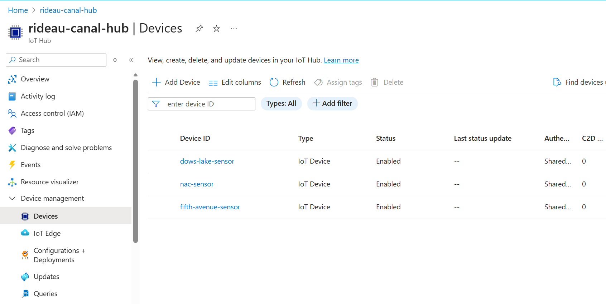
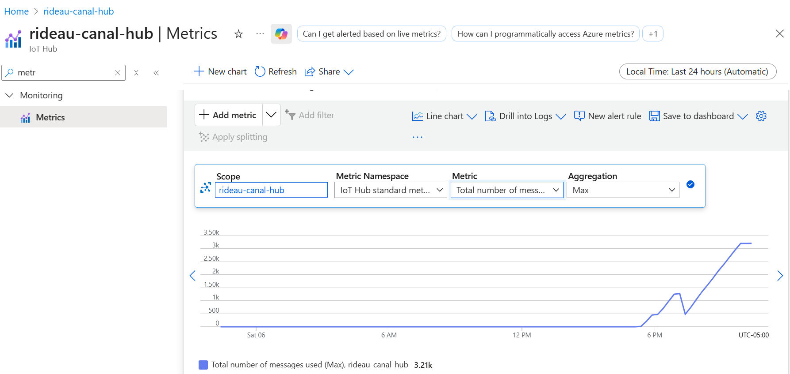
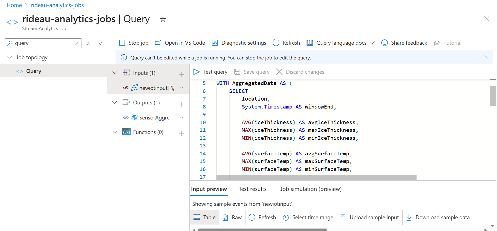
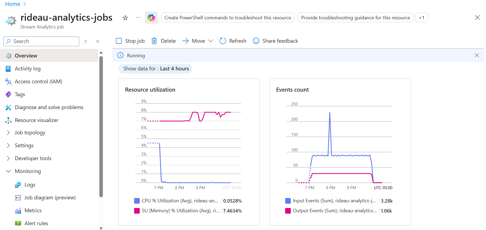
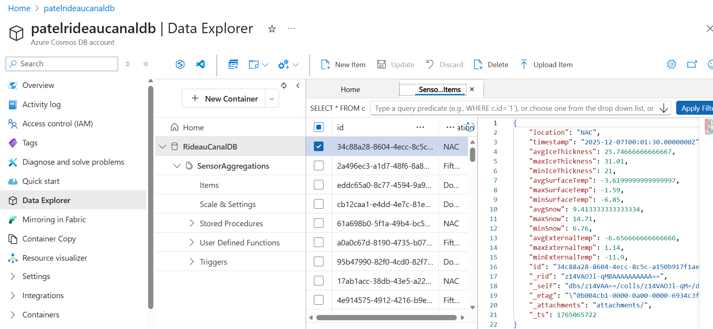
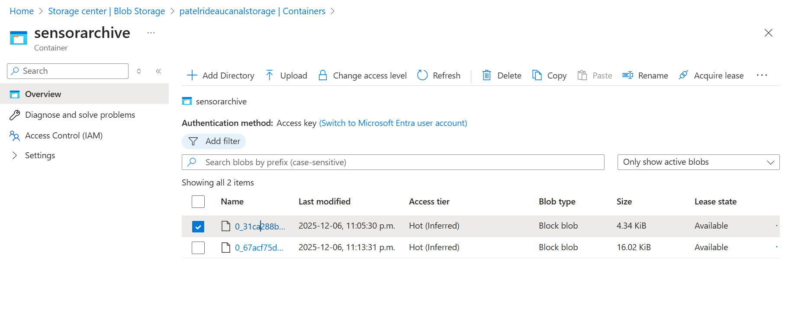
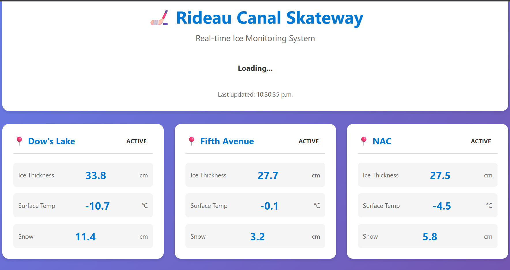
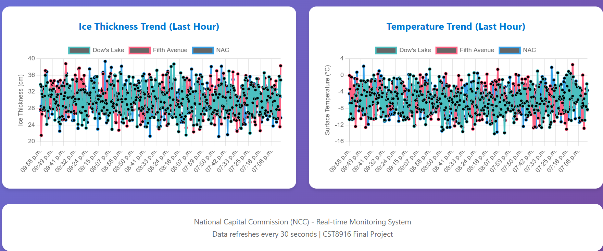
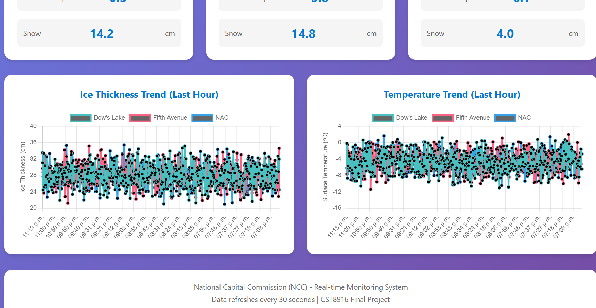

## 1. IoT Hub with 3 registered devices

## 2. IoT Hub metrics showing messages received

## 3. Stream Analytics query editor with your query

## 4. Stream Analytics job in "Running" state

## 5. Cosmos DB Data Explorer with sample documents

## 6. Blob Storage container with archived files

## 7. Dashboard running locally (showing live data)

## 8. Dashboard deployed on Azure App Service

